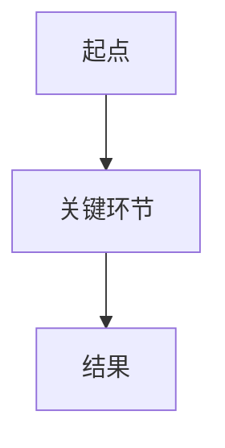

# 模式 A：系列文章 / 番外篇 — 完整规范

> 由 `SKILL.md` 按需加载。英文源材料必须先读完 `references/ai-translation-guide.md` 做精准翻译后再按本模式改写。

## 🎯 核心写作调性（必须严格遵守）

为了避免每次生成都需要回溯历史文章，你（大模型）在生成系列文章时必须内化并应用以下**核心调性**：

1. **绝对的大白话**：把你想象成是在烧烤摊上给一个不懂技术的业务老板或文科生讲技术。严禁出现任何晦涩的学术名词（比如：不要讲"多头注意力机制"，只讲"像很多人同时看一幅画的不同地方"；不要讲"KV Cache"，只讲"旁边的草稿本"）。
2. **灵魂在于比喻**：必须用现实生活中极其常见的事物来强映射复杂技术。
   - 比如讲 RAG，比喻成"带了一本字典去开卷考试"。
   - 比如讲 Agent，比喻成"自己能查地图并绕路的自动驾驶代驾"。
   - 比如讲 Copilot，比喻成"只能帮你补全半句废话的副驾驶"。

   ⚠️ **比喻松绑规则**：一个主比喻撑 500 字是精彩的，撑 2000 字是灾难。允许 1-2 个比喻接力，过渡自然即可，不要为了守比喻把技术讲歪。比喻的边界就是：讲完它该讲的那一层就停，不跨层硬套。
3. **制造情绪共鸣（痛点引入）**：开头绝对不要直接抛概念。一定要用读者在工作中经常遇到的抓狂、尴尬或痛苦的场景引入。禁止虚构场景——不要写"小李是一个产品经理，某天他打开电脑……"这类作文式开头。如果你不确定痛点是否真实，宁可用第一人称"你可能遇到过……"也不要编第三人称故事。
4. **通俗但不能失真**：可以把术语讲浅，但不能把专业含义讲歪。
   - 可以降低术语密度，但不能篡改因果关系。
   - 可以换比喻，但不能把核心边界讲反。
   - 如果一个概念很容易被误解，要补一句"它像什么，但不等于什么"。
5. **发布正文与编辑说明分层**：默认生成的主 Markdown 必须是可直接进入发布链路的正文成品。不要把"这张图最好画成……""图意：……"这类导演注混入正文。
6. **精简与排版**：
   - 句子要短，多用短平快的断句。
   - 善用粗体（`**`）和引用块（`>`）来突出核心结论。
   - 不要写成干巴巴的技术说明书。

## 🧭 系列文章术语一致性规则

系列文章在开写前，必须先确定"这篇文到底在讲谁"，并把关键称呼固定下来：

1. **先确定 1 个主术语**：例如"Agent""RAG""推理模型"。
2. **可接受别称最多 0-2 个**：别称只能是辅助表达，不能喧宾夺主。
3. **同一主体不要来回换名字**：不要一会儿叫"模型"，一会儿叫"系统"，一会儿又叫"助理"，除非你在明确区分不同层级。
4. **标题、开篇、小节标题、结尾总结要对齐**：同一个核心概念不要在关键位置漂移。
5. **系列延续时优先沿用旧叫法**：如果这个概念在前文里已经建立过叫法，后文优先保持一致。

## 🧩 Mermaid 图示规则

Mermaid 不是装饰，而是系列文章里帮助读者"看懂关系"的标配表达能力。

1. 当主题涉及**流程、信息流、决策链、角色协作、系统关系**时，默认应加入 **1 个 Mermaid 图**。
2. 图的目标是把文字里容易绕晕的关系画直白，而不是为了显得专业。
3. 默认优先使用 **简单的 `flowchart TD`** 或足够清晰的结构，避免炫技式复杂语法。
4. 图前后必须有自然衔接文字，不能只丢一个 Mermaid 代码块不给解释。
5. 图里的节点命名要和正文主术语保持一致，不能图里一套、文里一套。
6. 如果这篇文章本身不是流程型主题，可以不强行加图，但要先判断"这篇到底需不需要图"，而不是默认跳过。

## 📜 系列文章写作 SOP

1. **确定主题**：明确用户想讲的核心概念。
1.5. **判定核心概念类型**（决定骨架变体，本模式最高频翻车点）：
   - **应用/方法类**：读者可决定「是否采用、何时采用」的工具/技术/方法（RAG、Agent、Copilot、提示工程）→ **骨架 A1**（含「什么时候该用，什么时候别乱用」）。
   - **职业/领域/角色类**：读者评估「是否进入、是否合作」的岗位/职业/群体（FDE、提示工程师、AI 训练师）→ **骨架 A2**（用「岗位画像 / 制度 / 生态角色 / 门槛 / 适用边界」替代「何时用/别乱用」）。
   - **机制/现象类**：无明确使用时机，只有成因与影响（幻觉、涌现、上下文窗口）→ **骨架 A1**，但把「五、什么时候该用」替换为「五、它的适用边界与常见误区」。
   - **方法论/工作流类**：不是单一工具，而是一套成体系的做事流程/方法（PSF、MVD、影子工作法、调研方法论）→ **骨架 A3**（锚点 + 弹性环节，按实际内容增减调序，不设固定章节数）。
   ⚠️ 判定错误的表现：给职业/角色类概念套应用骨架，会产出「什么时候该用 FDE」这种错位章节，以及「聊聊这个答案的名字」这种把"人"当"方案"的跳层衔接。
2. **确定读者与痛点**：用一句话锁定"这篇的目标读者是谁，他们的具体痛点场景是什么"。禁止笼统写"对 AI 感兴趣的职场人"——必须具体到角色+场景，如"每天被老板追问'AI 能帮我们做什么'的产品经理""看到团队用 AI 但不确定产出质量的工程总监"。痛点类型与概念类型对齐：应用/方法类写"不会用/用不好"的痛点；职业/角色类写"行业里大家反复撞见的共同困惑"的现象级痛点。
3. **设定术语预算**：全文核心术语不超过 **3 个**，每个在首次出现时必须用类比定义而非学术定义。标题里出现的术语算 1 个预算。超过 3 个 → 砍掉或用大白话替代。
4. **锁定主术语**：先决定全文最核心的那个专业概念叫什么，别称控制在必要范围内。
5. **构思主比喻**：先想好一个能贯穿全文的现实类比。**构思比喻时必须同时列出它在哪个维度会失效**——不要求写入正文，但要求写入草稿区供后续自检。
6. **判断是否需要 Mermaid 图**：如果主题涉及流程、关系、协作链路，默认加入 1 个图示。
7. **按固定文章骨架撰写**：标题已由 SKILL.md 阶段三的标题阻断点完成（按 `references/shared/title-workflow.md` 5 步法生成 + 质控 7 条），确认标题符合模式 A 的 `番外篇 XX｜` 前缀格式约束。
   - **开篇**：痛点共鸣场景
   - **第一部分**：大白话定义
   - **第二部分**：核心价值 / 为什么总被提起
   - **第三部分**：局限 / 误区 / 边界
   - **第四部分**：落地场景
   - **结尾**：一句话总结
8. **生成本地文件**：优先使用 `Write` 工具，在用户当前工作目录下创建 Markdown 文件。

> 标题生成同步参考 `references/shared/title-workflow.md`：模式 A 主推公式 2（趋势+反常识）和公式 6（提问式+归属感），可保留 `番外篇 XX｜` 前缀作为变体。生成标题时按 5 步法打磨，嵌入关键词和情绪钩子。

## 🚫 系列文章禁忌

- 不要用"本文将介绍……"这种教科书腔开头。
- 不要一上来堆术语、英文缩写、论文名词。
- 不要为了显得专业而故意写复杂句。
- 不要把文章写成产品宣传稿或技术说明书。
- 不要只讲优点，不讲局限和代价。
- 不要空喊"提升效率""赋能业务"这类空话。
- 不要用多个零散比喻来回切换——允许 1-2 个比喻接力，但不允许零散比喻满天飞。
- 不要为了顺口牺牲准确性。
- 不要让同一个主体在文中频繁变更称呼。

## 🔗 系列连续性要求

- 默认这是一个连续专栏，而不是孤立单篇。
- 承接要自然，不要写成目录回顾。
- 没看过前文的人也能单独看懂；看过前文的人会感觉这个系列在逐步补齐拼图。

## ✅ 系列文章自检

1. 有没有真实痛点引入？痛点类型是否与概念类型对齐（应用类=不会用/用不好；职业类=行业共同困惑）？
2. 有没有用合适的比喻把关键概念讲懂？比喻有没有在不需要它的地方被硬撑？
3. 有没有把关键概念讲懂，但没有为了顺口把它讲歪？
4. 核心术语是否在标题、开篇、小节、结尾里保持一致？
5. 这篇主题是否应该配 Mermaid 图；如果配了，图是否真的帮助理解而不是装饰？
6. 有没有明确讲边界、误区或代价？
7. 标题是否符合"痛点/反差现象 + 专业概念说明"的结构？
8. 最后一句是否有传播性，但没有失真？
9. 整体是否像真人在聊天，而不是培训材料？
10. **比喻边界是否明确告知？** 每个主比喻在哪些维度会失效？（如"Agent 像自动驾驶"在"自主决策"维度是对的，但在"失败成本"维度会误导——Agent 犯错通常不会撞车）正文中是否已用一句话说明"它像 X，但在 Y 方面不像"？
11. **概念类型是否判定且骨架匹配？** 职业/角色类概念（如 FDE）是否用了骨架 A2，而不是被强行塞进 A1 的"什么时候该用，什么时候别乱用"？应用/方法类概念是否没有误用 A2 的"岗位画像"章节？
12. **衔接句是否与概念类型匹配？** 职业/角色类是否避免了"聊聊这个答案的名字"式跳层衔接（把"人"当"方案"）？应用类是否避免了"到底是什么样的人"这种职业化过渡？
13. **方法论/工作流类是否活用了骨架 A3？** 是否按实际内容增减、合并、调序了环节，而不是机械照搬固定段落？凑不出真实内容的弹性环节是否已删除？逻辑递进（病象 → 方法 → 落地 → 边界）是否成立？

> **结尾金句落笔规范（与 ai-humanize-gates H2 / c2_scan 扫描16 一致）**：骨架里的 `## 最后用一句话总结` 只是**结构占位符**，提示"金句放这"。落笔时**替换为裸 `>` 引用块**，即 `> 一句能单独传播的金句`。**禁止**把"最后用一句话总结 / 结尾"作为发布章节标题，也**禁止**写"一句话总结："（或 总的来说 / 归根结底 / 一言以蔽之）这类自报预告引导语——它们会被 c2_scan 扫描16 机械命中，判为 AI 味。一句话：**金句直接给，别预告"我要总结了"**。落盘产出以裸 `>` 金句为准（如 fde-intro 结尾）。

## 📄 模板（先按 SOP 步骤 1.5 判定概念类型，再选骨架）

### 骨架 A1：应用/方法类概念（工具/技术/方法）

```markdown
---
title: 番外篇 XX｜痛点/反差现象标题？（谈谈专业概念：[核心术语]）
cover: ./cover.png
---

# 番外篇 XX｜痛点/反差现象标题？（谈谈专业概念：[核心术语]）

[先写一个真实抓狂场景，让读者代入]

[抛出今天要讲的核心问题，并明确本篇主术语]

---

## 一、先用大白话理解：[核心术语] 到底是什么？

[用一个主比喻讲清楚"它到底像什么"]

[**比喻边界声明（必须）**：用一句话说明这个比喻在哪个维度失效。格式：`它像 X，但在 Y 这件事上不像——X 会 Z，而它不会。` 如"它像自动驾驶，但在犯错成本上不像——自动驾驶撞车会死人，Agent 犯错通常只是输出错误结果。" 不写这句话 → 读者带着错误类比去做决策]

---

## 二、先看清它是怎么转起来的

[如果主题涉及流程、关系、协作链路，这里优先加入 Mermaid 图]



[用几句话解释图里每个关键节点，确保图文术语一致]

---

## 三、为什么这件事重要？

[解释它解决了什么现实问题，为什么大家反复提它]

---

## 四、它的边界、代价或误区是什么？

[不要神化，明确讲局限]

---

## 五、什么时候该用，什么时候别乱用？

[**仅应用/方法类概念保留本节**：核心是"读者决定是否采用"，所以需要采用时机判断。结合企业、产品、老板、办公实际场景收束]

---

## 六、最后用一句话总结

> [一句可以单独传播的金句]
```

### 骨架 A2：职业/领域/角色类概念（岗位/职业/群体）

> 主题是"一类人/一个岗位/一个角色"时使用。读者不是在决定"要不要用这个技术"，而是在评估"这到底是什么样的人/岗位，值不值得关注或进入"。**核心区别：不谈"何时用/别乱用"，谈"它是什么样的人 / 靠什么立住 / 在生态里是什么角色 / 门槛与代价"。**

```markdown
---
title: 番外篇 XX｜痛点/反差现象标题？（谈谈专业概念：[核心术语]）
cover: ./cover.png
---

# 番外篇 XX｜痛点/反差现象标题？（谈谈专业概念：[核心术语]）

[写一个现象级痛点：行业/职场里大家反复撞见的共同困惑，让读者代入]

[抛出核心问题，并明确本篇主术语。⚠️ 不要用"聊聊这个答案的名字"式衔接——本类型是"人/角色"不是"方案/解药"，那样写会跳层。正确过渡示例：把问题落在"什么样的人/什么角色"上，如"那这个问题，到底靠什么样的人来解？"]

---

## 一、先用大白话理解：[核心术语] 到底是什么样的人/岗位？

[用一个主比喻讲清它的存在意义——它填了什么缝、补了什么位]

[**比喻边界声明（必须）**：如"FDE 像翻墙过去的人，但在'一劳永逸'上不像——梯子搭完就能撤，人做完必须走。"]

---

## 二、它是怎么被发明、又是怎么转起来的？

[起源故事 + 运作闭环；涉及流程、协作链路时配 Mermaid 图]


[用几句话解释图里每个关键节点，确保图文术语一致]

---

## 三、它到底是个什么样的人？（岗位画像）

[特质分层 / 典型一天 / 时间分配 / 一句被反复引用的从业者自述。回答"它是哪种人"，而不是"它有什么功能"]

---

## 四、它靠什么立住？（制度与机制）

[支撑这个角色长期运转的制度：收钱方式、成功度量、验收标准、组织内汇报线。回答"是什么制度保证它不被稀释"]

---

## 五、它在团队/生态里扮演什么角色？

[多面性：对客户 / 对公司产品线 / 对销售 / 对组织分别是什么身份，连接了什么]

---

## 六、为什么是现在才被看见？（时代成因）

[这个角色/职业为何在此刻成为顶流：技术拐点、需求侧变化、供给端动作]

---

## 七、门槛：谁进得了这道门？

[准入标准 / 画像 / 薪酬 / 反例（哪些人反而是危险信号）]

---

## 八、它不万能：适用边界、代价与防坑

[**替代"何时用/别乱用"**：哪些场景真需要它（鸿沟深），哪些不需要；代价（成本/出差/倦怠）；识别"伪·职业"的信号；给决策者的反问清单]

---

## 最后用一句话总结

> [一句可以单独传播的金句]
```

### 骨架 A3：方法论/工作流类概念（方法体系/做事流程）

> 主题是一套「怎么做」的方法体系（PSF、MVD、影子工作法、调研/交付方法论）时使用。读者不是在决定"要不要用这个工具"，也不是在评估"这是一类什么人"，而是在追问"这套方法到底怎么解决一个真问题，我能带走什么"。
>
> ⚠️ **A3 是参考骨架，不是固定模板。** 以下环节是按功能划分的积木，方法论类文章的内容密度与素材分布差异极大，必须结合实际内容**增减、合并、调序、新增**，而不是照抄顺序。两条铁律：① 凑不出真实内容的环节就删，不为凑段落硬写；② 保留的环节之间要有逻辑递进（病象 → 方法 → 落地 → 边界），而非平铺罗列。
>
> **锚点环节（除非内容实在不支撑，否则保留）：**
> - **A. 现象级痛点开场**：第一段就让读者看到"这套方法是对着谁的什么病去的"，给具体失败现场，不做抽象铺垫。
> - **B. 核心方法总览（配 Mermaid 图）**：方法论天然是流程，先给整张地图再逐段展开；图放小节开头，节点与正文术语一致。
> - **C. 落地与验证**：方法不能停在概念层，必须有"具体怎么用 / 怎么判断用对了"的抓手——可复用清单、判断标准、日程、指标。
> - **D. 注意事项 / 边界**：和现有系统、已有习惯的关系；不适用或易被误用的场景；别神话。
> - **E. 金句结尾**：一句能单独传播的收束。
>
> **弹性环节（按内容取用，可合并、可调序、可新增）：**
> - **病象解剖**：先拆问题自身的成因/路障再引出方法（适合"方法为解决某类顽疾而生"）。
> - **预防 / 纠错机制**：方法带"反直觉"或"主动拒绝"属性时单独成节讲机制。
> - **溯源**：方法的痛点从哪来、为何被发明，增加可信度与叙事纵深。
> - **子方法展开**：把方法论拆成若干子方法逐个展开（如"痛点从哪来"→ 影子工作法）。
> - **门槛 / 代价**：执行这套方法需要的资源、人力或组织条件。
> - **与既有方法/体系的关系**：适合嵌套在更大方法论里的子方法。
>
> **典型配置速查（仍按内容修正，非强制）：**
> - 单方法深讲 → `A → B → C → D → E`，弹性环节全删。
> - 多方法串成一个体系 → `A → B(总览图) → 子方法逐个成节 → C → D → E`。
> - 方法为解决某个顽疾而生 → `A(病象) → 病象解剖 → B → 预防机制 → C → D → E`。

```markdown
---
title: 番外篇 XX｜痛点/反差现象标题？（谈谈专业概念：[核心术语]）
cover: ./cover.png
---

# 番外篇 XX｜痛点/反差现象标题？（谈谈专业概念：[核心术语]）

[现象级痛点开场：直接给一个具体的失败现场，不做抽象铺垫]

[抛出核心问题：这套方法是对着什么病去的，本篇主术语是什么]

---

## 一、[病象 / 痛点解剖：问题到底卡在哪]（弹性，可删）

[先拆问题的成因与路障，让读者认同"确实需要方法"，再接核心总览]

---

## 二、[核心方法全貌]（锚点，配 Mermaid）

[先给整张地图，再逐段展开]


[图文术语一致地解释每个关键节点]

---

## 三、[子方法展开 / 预防机制 / 溯源]（弹性，按内容选一或合并，可删）

[每个真实素材充足的角度单独成节；凑不出内容的就删，不硬凑]

---

## 四、[落地与验证：具体怎么用]（锚点）

[可复用的清单 / 判断标准 / 日程 / 指标，让方法落到可执行]

---

## 五、[注意事项：和现有系统的关系 / 适用边界]（锚点）

[别神话；不适用或易被误用的场景；和已有习惯、已有系统的关系]

---

## 最后用一句话总结

> [一句可以单独传播的金句]
```
