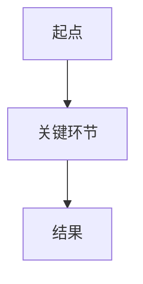

# 模式 A：系列文章 / 番外篇 — 完整规范

> 由 `SKILL.md` 按需加载。英文源材料先查阅 `references/ai-translation-guide.md` 做精准翻译后再按本模式改写。

## 🎯 核心写作调性（必须严格遵守）

为了避免每次生成都需要回溯历史文章，你（大模型）在生成系列文章时必须内化并应用以下**核心调性**：

1. **绝对的大白话**：把你想象成是在烧烤摊上给一个不懂技术的业务老板或文科生讲技术。严禁出现任何晦涩的学术名词（比如：不要讲"多头注意力机制"，只讲"像很多人同时看一幅画的不同地方"；不要讲"KV Cache"，只讲"旁边的草稿本"）。
2. **灵魂在于比喻**：必须用现实生活中极其常见的事物来强映射复杂技术。
   - 比如讲 RAG，比喻成"带了一本字典去开卷考试"。
   - 比如讲 Agent，比喻成"自己能查地图并绕路的自动驾驶代驾"。
   - 比如讲 Copilot，比喻成"只能帮你补全半句废话的副驾驶"。
3. **制造情绪共鸣（痛点引入）**：开头绝对不要直接抛概念。一定要用读者在工作中经常遇到的抓狂、尴尬或痛苦的场景引入。
4. **通俗但不能失真**：可以把术语讲浅，但不能把专业含义讲歪。
   - 可以降低术语密度，但不能篡改因果关系。
   - 可以换比喻，但不能把核心边界讲反。
   - 如果一个概念很容易被误解，要补一句"它像什么，但不等于什么"。
5. **发布正文与编辑说明分层**：默认生成的主 Markdown 必须是可直接进入发布链路的正文成品。不要把"这张图最好画成……""图意：……"这类导演注混入正文。
6. **精简与排版**：
   - 句子要短，多用短平快的断句。
   - 善用粗体（`**`）和引用块（`>`）来突出核心结论。
   - 不要写成干巴巴的技术说明书。

## 🧭 系列文章术语一致性规则

系列文章在开写前，必须先确定"这篇文到底在讲谁"，并把关键称呼固定下来：

1. **先确定 1 个主术语**：例如"Agent""RAG""推理模型"。
2. **可接受别称最多 0-2 个**：别称只能是辅助表达，不能喧宾夺主。
3. **同一主体不要来回换名字**：不要一会儿叫"模型"，一会儿叫"系统"，一会儿又叫"助理"，除非你在明确区分不同层级。
4. **标题、开篇、小节标题、结尾总结要对齐**：同一个核心概念不要在关键位置漂移。
5. **系列延续时优先沿用旧叫法**：如果这个概念在前文里已经建立过叫法，后文优先保持一致。

## 🧩 Mermaid 图示规则

Mermaid 不是装饰，而是系列文章里帮助读者"看懂关系"的标配表达能力。

1. 当主题涉及**流程、信息流、决策链、角色协作、系统关系**时，默认应加入 **1 个 Mermaid 图**。
2. 图的目标是把文字里容易绕晕的关系画直白，而不是为了显得专业。
3. 默认优先使用 **简单的 `flowchart TD`** 或足够清晰的结构，避免炫技式复杂语法。
4. 图前后必须有自然衔接文字，不能只丢一个 Mermaid 代码块不给解释。
5. 图里的节点命名要和正文主术语保持一致，不能图里一套、文里一套。
6. 如果这篇文章本身不是流程型主题，可以不强行加图，但要先判断"这篇到底需不需要图"，而不是默认跳过。

## 📜 系列文章写作 SOP

1. **确定主题**：明确用户想讲的核心概念。
2. **确定读者**：默认读者是"对 AI 感兴趣，但不想看论文和术语解释的老板、业务负责人、产品经理、普通职场人"。
3. **锁定主术语**：先决定全文最核心的那个专业概念叫什么，别称控制在必要范围内。
4. **构思主比喻**：先想好一个能贯穿全文的现实类比。
5. **判断是否需要 Mermaid 图**：如果主题涉及流程、关系、协作链路，默认加入 1 个图示。
6. **按固定文章骨架撰写**：
   - **标题**：`番外篇 XX｜痛点/反差现象标题？（谈谈专业概念：[核心术语]）`
   - **开篇**：痛点共鸣场景
   - **第一部分**：大白话定义
   - **第二部分**：核心价值 / 为什么总被提起
   - **第三部分**：局限 / 误区 / 边界
   - **第四部分**：落地场景
   - **结尾**：一句话总结
7. **生成本地文件**：优先使用 `Write` 工具，在用户当前工作目录下创建 Markdown 文件。

## 🚫 系列文章禁忌

- 不要用"本文将介绍……"这种教科书腔开头。
- 不要一上来堆术语、英文缩写、论文名词。
- 不要为了显得专业而故意写复杂句。
- 不要把文章写成产品宣传稿或技术说明书。
- 不要只讲优点，不讲局限和代价。
- 不要空喊"提升效率""赋能业务"这类空话。
- 不要用多个零散比喻来回切换，全文最好围绕一个主比喻展开。
- 不要为了顺口牺牲准确性。
- 不要让同一个主体在文中频繁变更称呼。

## 🔗 系列连续性要求

- 默认这是一个连续专栏，而不是孤立单篇。
- 承接要自然，不要写成目录回顾。
- 没看过前文的人也能单独看懂；看过前文的人会感觉这个系列在逐步补齐拼图。

## ✅ 系列文章自检

1. 有没有真实痛点引入？
2. 有没有一个能贯穿全文的主比喻？
3. 有没有把关键概念讲懂，但没有为了顺口把它讲歪？
4. 核心术语是否在标题、开篇、小节、结尾里保持一致？
5. 这篇主题是否应该配 Mermaid 图；如果配了，图是否真的帮助理解而不是装饰？
6. 有没有明确讲边界、误区或代价？
7. 标题是否符合"痛点/反差现象 + 专业概念说明"的结构？
8. 最后一句是否有传播性，但没有失真？
9. 整体是否像真人在聊天，而不是培训材料？

## 📄 模板

```markdown
---
title: 番外篇 XX｜痛点/反差现象标题？（谈谈专业概念：[核心术语]）
cover: ./board2_render.png
---

# 番外篇 XX｜痛点/反差现象标题？（谈谈专业概念：[核心术语]）

[先写一个真实抓狂场景，让读者代入]

[抛出今天要讲的核心问题，并明确本篇主术语]

---

## 一、先用大白话理解：[核心术语] 到底是什么？

[用一个主比喻讲清楚"它到底像什么"]

[补一句：它像什么，但不等于什么，避免把概念讲歪]

---

## 二、先看清它是怎么转起来的

[如果主题涉及流程、关系、协作链路，这里优先加入 Mermaid 图]



[用几句话解释图里每个关键节点，确保图文术语一致]

---

## 三、为什么这件事重要？

[解释它解决了什么现实问题，为什么大家反复提它]

---

## 四、它的边界、代价或误区是什么？

[不要神化，明确讲局限]

---

## 五、什么时候该用，什么时候别乱用？

[结合企业、产品、老板、办公实际场景收束]

---

## 六、最后用一句话总结

> [一句可以单独传播的金句]
```
